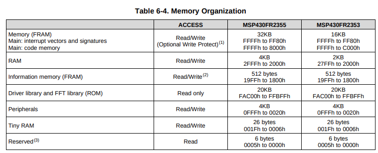

# msp430-baremetal
bare metal programming using GCC compiler and a datasheet without using any framework.
The goal is to understand how frameworks like Arduino work.

Target Device: TI-MSP4302355

## Memory and regisers

``` markdown



